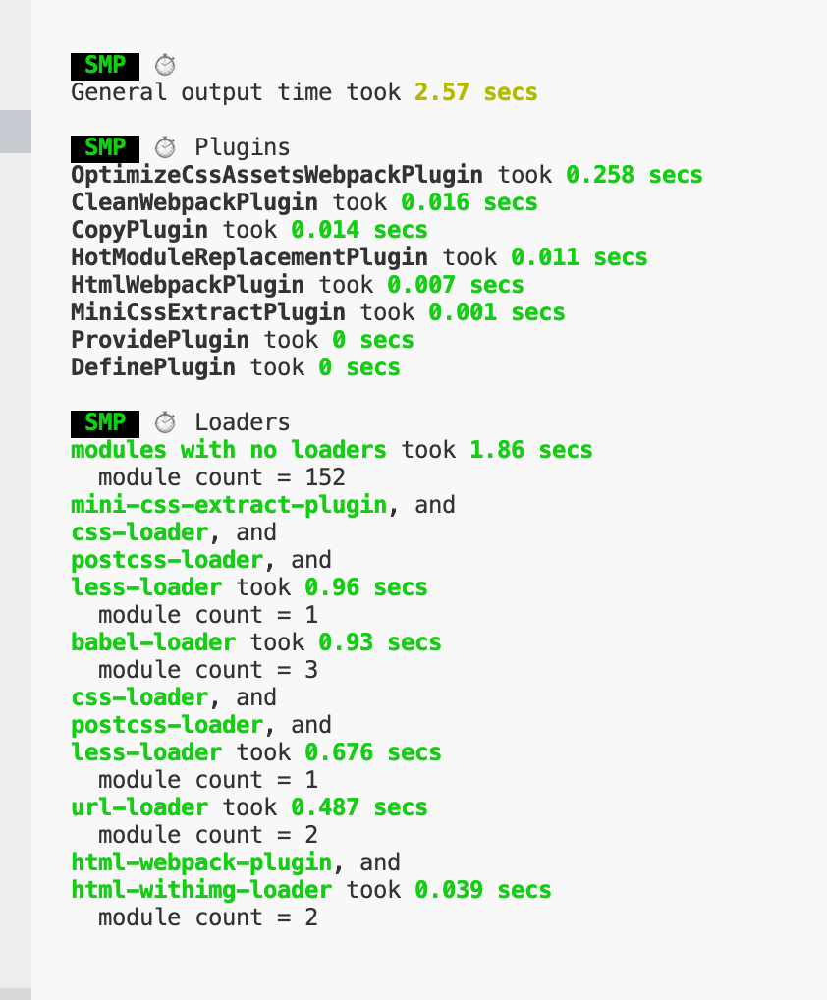

### webpack知识点
+ npx webpack --mode=development --> 构建项目,或者配置好mode:development,直接执行npx webpack
+ 0.安装webpack
```
yarn add webpack webpack-cli -D
```

+ 1.将js转成es5
```js
yarn add babel-loader @babel/core @babel/preset-env @babel/plugin-transform-runtime @babel/runtime @babel/runtime-corejs3 -D
```
```js
module: {
  rules: [
    {
      test: /\.jsx?$/,
      use: {
        loader: 'babel-loader',
        options: {
          presets: ['@babel/preset-env'],
          plugins: [
            ["@babel/plugin-transform-runtime", {
            "corejs": 3
            }]
          ]
        }
      },
      exclude: /node_modules/,
    }
  ]
},
```
+ 2.解析html html-webpack-plugin
```
yarn add html-webpack-plugin -D 
```

```js
plugins: [
  new HtmlWebpackPlugin({
    title: 'My App',
    filename: 'index.html',
    template: './public/index.html'
  })
],
```
+ 3.cross-env能跨平台地设置及使用环境变量
```
yarn add cross-env -D
```

```js
  "scripts": {
    "dist": "cross-env NODE_ENV=production webpack",
    "dev":"cross-env NODE_ENV=development webpack-dev-server"
  },
```
+ 4.在浏览器中展示效果
```
yarn add webpack-dev-server -D
```

```js
  devServer: {
    port: '3000', //默认是8080
    quiet: false, //默认不启用
    inline: true, //默认开启 inline 模式，如果设置为false,开启 iframe 模式
    stats: "errors-only", //终端仅打印 error
    overlay: false, //默认不启用
    clientLogLevel: "silent", //日志等级
    compress: true, //是否启用 gzip 压缩
    open: true,//Tells dev-server to open the browser after server had been started. Set it to true to open your default browser.
  },
```
+ 5.devtool 选择一种 source map 格式来增强调试过程。不同的值会明显影响到构建(build)和重新构建(rebuild)的速度。
```js
  devtool: 'eval-cheap-module-source-map'//原始源代码（仅限行）
```
+ 6.解析css和less文件.webpack 不能直接处理 css，需要借助 loader。如果是 .css，我们需要的 loader 通常有： style-loader、css-loader，考虑到兼容性问题，还需要 postcss-loader，而如果是 less 或者是 sass 的话，还需要 less-loader 和 sass-loader，这里配置一下 less 和 css 文件(sass 的话，使用 sass-loader即可):建议less,因为less-loader一直有人维护
```
npm install style-loader less-loader css-loader postcss-loader autoprefixer less -D
```
```js
{
  test: /\.(le|c)ss/,
  use: ['style-loader', 'css-loader', {
    loader: 'postcss-loader',
    options: {
      plugins() {
        return [
          require('autoprefixer')({
            "overrideBrowserslist": [
              ">0.25%",//全球超过0.25%人使用的浏览器
              "not dead"//流行的浏览器
            ]
          })
        ]
      }
    }
  }, 'less-loader'],
  exclude: /node_modules/
}
```
+ 7.图片/字体文件处理
```
yarn add url-loader file-loader -D
```

```js
{
  test: /\.(png|jpg|gif|jpeg|webp|svg|eot|ttf|woff|woff2)$/,
  use :[
    {
      loader: 'url-loader',
      options: {
        limit: 10240,
        esModule: false,
        name: '[name]_[hash:5].[ext]',
        outputPath: 'assets'
      }
    }
  ]
}
```
+ 8处理 html 中的本地图片,安装 html-withimg-loader 来解决咯。
```
yarn add html-withimg-loader -D
```

```js
{
  test: /\.html$/,
  use: ['html-withimg-loader']
}
```
+ 9.每次打包前清空dist目录,反正我是懒得手动去清理的，只要你足够懒，你总是会找到好办法的，懒人推动科技进步。这里，我们需要插件: clean-webpack-plugin
```
yarn add clean-webpack-plugin -D
```

```js
  plugins: [
    new CleanWebpackPlugin(),
  ],
```

+ 10.静态资源拷贝, [CopyWebpackPlugin]，它的作用就是将单个文件或整个目录复制到构建目录

```
yarn add copy-webpack-plugin -D
```

```js
new CopyWebpackPlugin({
  patterns: [{
    from: 'public/js/*.js',
    to: path.resolve(__dirname, 'dist', 'js'),
    // ?建议设置为true,不设置true还是会报错,flatten 这个参数，设置为 true，那么它只会拷贝文件，而不会把文件夹路径都拷贝上
    flatten: true,
    // 但是想过滤掉某个或某些文件，那么 CopyWebpackPlugin 还为我们提供了 ignore 参数。npm run build 构建，可以看到 dist/js 下不会出现 other.js 文件
    globOptions: {
      ignore: ['**/other.js']
    }
  }],
}),
```

+ 11.ProvidePlugin,`ProvidePlugin` 的作用就是不需要 `import` 或 `require` 就可以在项目中到处使用
  - ` ProvidePlugin` 是 `webpack` 的内置插件，使用方式如下：

```
new Webpack.ProvidePlugin({
      $:'jquery',
      React: 'react',
      useState: ['react','useState']
})
```

+ 12.抽离CSS

```
yarn add mini-css-extract-plugin -D
```

```
plugins: [
	new MiniCssExtractPlugin({
      filename: '[name].css',
      chunkFilename: '[id].css',
    })
]
```

+ 13.将抽离出来的css文件进行压缩

  使用 `mini-css-extract-plugin`，`CSS` 文件默认不会被压缩，如果想要压缩，需要配置 `optimization`，首先安装 `optimize-css-assets-webpack-plugin`.

  ```
  yarn add optimize-css-assets-webpack-plugin -D
  ```

  ```js
  plugins: [
    new OptimizeCssAssetsPlugin()
  ]
  ```

+ 14.热更新

  - 首先配置 `devServer` 的 `hot` 为 `true`
  - 并且在 `plugins` 中增加 `new webpack.HotModuleReplacementPlugin()`

  ```js
  plugins: [
    new webpack.HotModuleReplacementPlugin({})
  ]
  ```

  - 我们配置了 `HotModuleReplacementPlugin` 之后，会发现，此时我们修改代码，仍然是整个页面都会刷新。不希望整个页面都刷新，还需要修改入口文件：

  ```js
  // index.js 此时，再修改代码，不会造成整个页面的刷新。
  if(module && module.hot) {
      module.hot.accept()
  }
  ```

+ 15.多页应用打包,`HtmlWebpackPlugin` 提供了一个 `chunks` 的参数，可以接受一个数组，配置此参数仅会将数组中指定的js引入到html文件中

  ```js
  let HtmlWebpackPlugin = require('html-webpack-plugin')
  let path = require('path')
  module.exports = {
    entry: {//多页应用,不止一个入口
      index: './src/index.js',
      login: './src/login.js'
    },
    output: {
      // 注意,多页应用需要加[name],不然名字一样
      filename: '[name].[hash:6].js',
      path: path.resolve(__dirname, 'dist')
    },
    plugins: [
      new HtmlWebpackPlugin({
        template: './public/index.html',//源文件
        filename: 'index.html', //打包后的文件名
        chunks: ['index'],// 多页应用时指定加载js文件
      }),
      new HtmlWebpackPlugin({
        template: './public/login.html',
        filename: 'login.[hash:6].html',
        chunks: ['login'],
      }),
    ]
  }
  ```

+ 16.解析(resolve),这些选项能设置模块如何被解析。webpack 提供合理的默认值，但是还是可能会修改一些解析的细节。

  - resolve.alias: 创建 `import` 或 `require` 的别名，来确保模块引入变得更简单。例如，一些位于 src/ 文件夹下的常用模块：

  ```js
  resolve: {
    // 创建 import 或 require 的别名，来确保模块引入变得更简单。例如，一些位于 src/ 文件夹下的常用模块：
    alias: {
      'Com': path.resolve(__dirname, 'src/components')
    }
  }
  ```

  - 以后就可以直接引入Com,而不是根据相对路径去找

  ```js
  import { View, ListView, StyleSheet, Animated } from 'Com';
  ```

+ 17.区分不同的环境,目前为止我们 `webpack` 的配置，都定义在了 `webpack.config.js` 中，对于需要区分是开发环境还是生产环境的情况，我们根据 `process.env.NODE_ENV` 去进行了区分配置，但是配置文件中如果有多处需要区分环境的配置，这种显然不是一个好办法

  更好的做法是创建多个配置文件，如: `webpack.base.js`、`webpack.dev.js`、`webpack.prod.js`。

  - `webpack.config.base.js` 定义公共的配置
  - `webpack.config.dev.js`：定义开发环境的配置
  - `webpack.config.prod.js`：定义生产环境的配置
  - [webpack-merge](https://www.npmjs.com/package/webpack-merge) 专为 `webpack` 设计，提供了一个 `merge` 函数，用于连接数组，合并对象。

  ```js
  yarn add webpack-merge -D
  ```

  修改package.json中的scripts

  ```js
  "scripts": {
    "dev": "cross-env NODE_ENV=development webpack-dev-server --config=webpack.config.dev.js",
    "prod": "cross-env NODE_ENV=production webpack-dev-server --config=webpack.config.prod.js",
    "build": "cross-env NODE_ENV=production webpack --config=webpack.config.prod.js"
  },
  ```

  例如在webpack.config.dev.js,这样配置

  ```js
  // webpack.config.dev.js
  const { merge } = require('webpack-merge');
  const baseWebpackConfig = require('./webpack.config.base')
  const Webpack = require('webpack')
  
  module.exports = merge(baseWebpackConfig, {
    mode: 'development',
    // 其他配置...
  })
  ```

+ 18.DefinePlugin: *定义全局常量*

  DefinePlugin` 允许创建一个在**编译**时可以配置的全局常量,这可能会对开发模式和发布模式的构建允许不同的行为非常有用。如果在开发构建中，而不在发布构建中执行日志记录，则可以使用全局常量来决定是否记录日志。

  使用 `webpack` 内置插件 `DefinePlugin` 来定义全局常量。

  - 如果 `value` 是一个字符串，会被当做 `code` 片段
  - 如果 `value` 不是一个字符串，会被`stringify`
  - 如果 `value` 是一个对象，正常对象定义即可
  - 如果 `key` 中有 `typeof`，它只针对 `typeof` 调用定义

  ```js
  plugins: [
    // 可以配置的全局常量,在使用的时候直接用不需要process.env语法,
    new webpack.DefinePlugin({
      BOOLEAN: true,//布尔类型正常定义和使用
      NUM: 123,//number类型正常定义和使用
      STRING: JSON.stringify('hello'),//string类型定义需要JSON.stringify(),正常使用
      ARR: [1,2,3],//布尔类型正常定义,但使用的时候会转成对象{0: 1, 1: 2, 2: 3}
      OBJ: {//对象类型正常定义和使用,但是里面的字符串还是需要JSON.stringify()转化
        name: JSON.stringify('guocheng')
      }
    })
  ]
  ```

+ 19.利用webpack解决跨域问题

  假设前端在3000端口，服务端在4000端口，我们通过 `webpack` 配置的方式去实现跨域。首先，我们在本地创建一个 `server.js`：

  ```js
  router.get('/data', (req,res)=>{
    res.json({name: '刘小夕'})
  })
  ```

  + 修改 `webpack` 配置:

  ```js
  //配置代理,请求到 /api/users 现在会被代理到请求 http://localhost:3000/api/users
  // proxy: {
  //   '/api': 'http://localhost:3000'
  // },
  // 如果你不想始终传递 /api ，则需要重写路径：
  // !虽然设置了代理,但是在浏览器的network中仍然显示未代理的路径: http://localhost:4000/get/data
  proxy: {
    // 如果后端接口也是api开头,则请求/api/user-->http://localhost:3000/api/user
    "/api": {
      target: "http://localhost:3000",
        // pathRewrite: {"^/api" : ""}
    },
      // 如果后端接口不是api开头,则请求/get/data-->http://localhost:3000/data
      '/get': {
        target: 'http://localhost:3000',
          pathRewrite:{'^/get': ''}
      }
    }
  ```

### webpack优化

+ 1.量化

  `speed-measure-webpack-plugin` 插件可以测量各个插件和`loader`所花费的时间

  The first step to optimising your webpack build speed, is to know where to focus your attention.

  This plugin measures your webpack build speed, giving an output like this:

  ```js
  yarn add speed-measure-webpack-plugin -D
  ```

  

  webpack中配置:

  ```js
  // webpack.config.dev.js
  const { merge } = require('webpack-merge');
  const baseWebpackConfig = require('./webpack.config.base')
  const SpeedMeasurePlugin = require("speed-measure-webpack-plugin");
  const smp = new SpeedMeasurePlugin();
  module.exports = smp.wrap(merge(baseWebpackConfig, {
    mode: 'development',
    // 其他配置...
  }))
  ```

+ 2.include/exclude

  我们可以通过 `exclude`、`include` 配置来确保转译尽可能少的文件。顾名思义，`exclude` 指定要排除的文件，`include` 指定要包含的文件。

  `exclude` 的优先级高于 `include`，在 `include` 和 `exclude` 中使用绝对路径数组，尽量避免 `exclude`，更倾向于使用 `include`。

  ```js
  rules: [
    {
      test: /\.jsx?$/,
      use: ['babel-loader'],
      // exclude: /node_modules/
      include: [path.resolve(__dirname, 'src')]
    },
  ]
  ```

+ 3.cache-loader

  在一些性能开销较大的 `loader` 之前添加 `cache-loader`，将结果缓存中磁盘中。默认保存在 `node_modueles/.cache/cache-loader` 目录下。

  `cache-loader` 的配置很简单，放在其他 `loader` 之前即可。修改`Webpack` 的配置如下:

  ```js
  yarn add cache-loader -D
  ```

  ```js
  {
    test: /\.jsx?$/, //匹配规则
      // 直接这样写需要在外层写一个.babelrc文件,可以直接在这里配置babel
      // use: ['babel-loader'],
      use: [
        'cache-loader',
        {
          loader: 'babel-loader',
          options: {
            presets: ["@babel/preset-env"],
            plugins: [
              ["@babel/plugin-transform-runtime", {
                "corejs": 3
              }]
            ]
          }
        }
      ],
        // exclude: /node_modules/, //排除 node_modules 目录
        include: [path.resolve(__dirname, 'src')]
  }
  ```

+ 4.happypack

  由于有大量文件需要解析和处理，构建是文件读写和计算密集型的操作，特别是当文件数量变多后，`Webpack` 构建慢的问题会显得严重。文件读写和计算操作是无法避免的，那能不能让 `Webpack` 同一时刻处理多个任务，发挥多核 CPU 电脑的威力，以提升构建速度呢？

  `HappyPack` 就能让 `Webpack` 做到这点，它把任务分解给多个子进程去并发的执行，子进程处理完后再把结果发送给主进程。

  ```js
  yarn add happypack -D
  ```

  修改配置文件

  ```js
  const Happypack = require('happypack');
  module.exports = {
      //...
      module: {
          rules: [
              {
                  test: /\.js[x]?$/,
                  use: 'Happypack/loader?id=js',
                  include: [path.resolve(__dirname, 'src')]
              },
              {
                  test: /\.css$/,
                  use: 'Happypack/loader?id=css',
                  include: [
                      path.resolve(__dirname, 'src'),
                      path.resolve(__dirname, 'node_modules', 'bootstrap', 'dist')
                  ]
              }
          ]
      },
      plugins: [
          new Happypack({
              id: 'js', //和rule中的id=js对应
              //将之前 rule 中的 loader 在此配置
              use: ['babel-loader'] //必须是数组
          }),
          new Happypack({
              id: 'css',//和rule中的id=css对应
              use: ['style-loader', 'css-loader','postcss-loader'],
          })
      ]
  }
  
  ```

  另外，当你的项目不是很复杂时，不需要配置 `happypack`，因为进程的分配和管理也需要时间，并不能有效提升构建速度，甚至会变慢。

+ 5.thread-loader

  除了使用 `Happypack` 外，我们也可以使用 `thread-loader` ，把 `thread-loader` 放置在其它 `loader` 之前，那么放置在这个 `loader` 之后的 `loader` 就会在一个单独的 `worker` 池中运行。

  在 worker 池(worker pool)中运行的 loader 是受到限制的。例如：

  - 这些 `loader` 不能产生新的文件。
  - 这些 `loader` 不能使用定制的 `loader` API（也就是说，通过插件）。
  - 这些 `loader` 无法获取 `webpack` 的选项设置。

  首先安装依赖

  ```js
  yarn add thread-loader -D
  ```

  修改配置

  ```js
  module.exports = {
      module: {
          //我的项目中,babel-loader耗时比较长，所以我给它配置 thread-loader
          rules: [
              {
                  test: /\.jsx?$/,
                  use: ['thread-loader', 'cache-loader', 'babel-loader']
              }
          ]
      }
  }
  ```

  `thread-loader` 和 `Happypack` 我对比了一下，构建时间基本没什么差别。不过 `thread-loader` 配置起来为简单。

+ 6.HardSourceWebpackPlugin

  配置 `hard-source-webpack-plugin`，首次构建时间没有太大变化，但是第二次开始，构建时间大约可以节约 80%。

  ```js
  yarn add hard-source-webpack-plugin -D
  ```

  修改配置:

  ```js
  //webpack.config.js
  var HardSourceWebpackPlugin = require('hard-source-webpack-plugin');
  module.exports = {
      //...
      plugins: [
          new HardSourceWebpackPlugin()
      ]
  }
  ```

+ 7.noParse

  防止 webpack 解析那些任何与给定正则表达式相匹配的文件。忽略的文件中**不应该含有** `import`, `require`, `define` 的调用，或任何其他导入机制。忽略大型的 library 可以提高构建性能。

  [noParse](http://webpack.html.cn/configuration/module.html) 属性的值是一个正则表达式或者是一个 `function`

  ```js
  noParse: /jquery|lodash/
  
  // 从 webpack 3.0.0 开始
  noParse: function(content) {
    return /jquery|lodash/.test(content);
  }
  ```

+ 8. Dllplugin&DllReferencePlugin

  有些时候，如果所有的JS文件都打成一个JS文件，会导致最终生成的JS文件很大，这个时候，我们就要考虑拆分 `bundles`

  https://juejin.im/post/6844904093463347208#heading-11